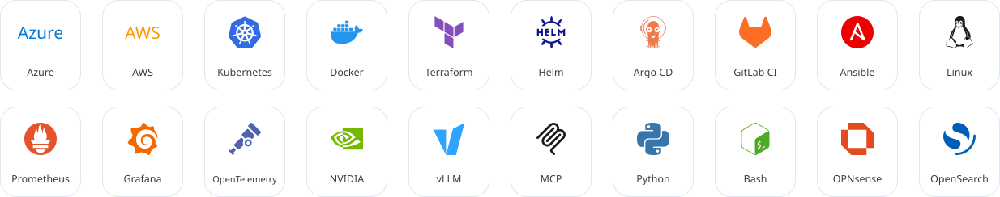
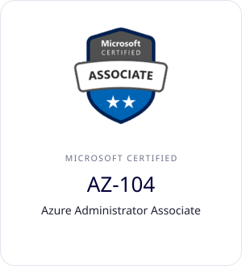
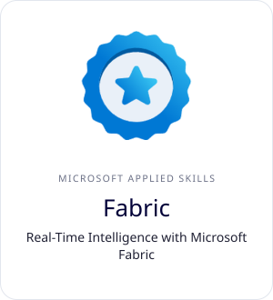
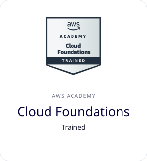
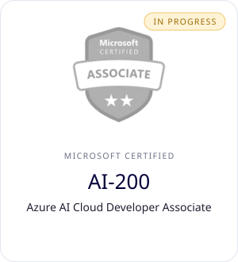
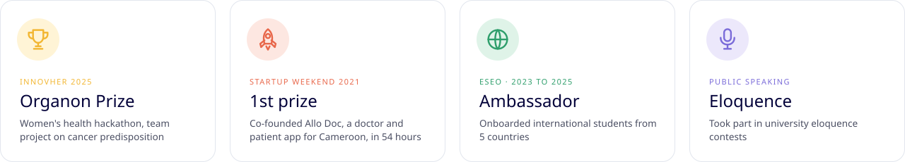
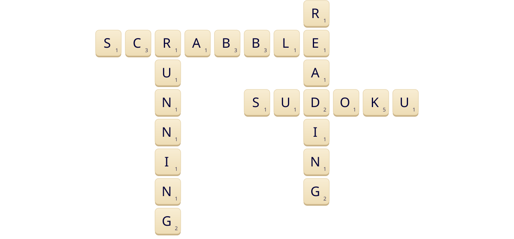

Cloud & AI platform engineer in Strasbourg. I build and run the infrastructure behind generative AI for an industrial company: containers, API gateways in front of LLMs, infrastructure as code and monitoring. I am also an AI business analyst and work with business teams to scope AI projects.

On my own time, I run a self-hosted LLM platform and write [Grace Your Brain](https://graceyourbrain.com/), a blog on Cloud, AI, DevOps and FinOps.

Most of my projects live on [GitLab](https://gitlab.com/gramia).

## Currently

- Building an agentic stack: K3s, a remote NVIDIA GPU, vLLM and an MCP server I use from VS Code.
- Working through [Under the hood](https://gitlab.com/researches-gramia/under-the-hood), an 8-week study of Linux, containers, Kubernetes, networking, IaC, LLMs and observability. Notes and labs are public.
- Writing the next articles for Grace Your Brain.

## Selected work

<b>Project notes</b>

**llm-platform**: K3s cluster with a remote NVIDIA GPU reached over Tailscale. Models are served with vLLM (OpenAI-compatible API) and Open WebUI. GPU metrics go through DCGM Exporter, Prometheus and Grafana. A Python MCP server exposes Kubernetes, GPU and vLLM operations to VS Code.

**cloud-landing-zone**: Azure landing zone in Terraform and 2 AKS clusters (pre-production and production). I compared 5 to 8 tools for each pillar (FinOps, deployment, security, monitoring). OpenCost, Prometheus, Grafana and Argo CD were adopted.

**datacenter**: school project, team of 6. Routing and switching, DHCP/DDNS, OPNsense firewall, load balancing and reverse proxy, Ansible and Vagrant, Zabbix and Grafana, disaster recovery plan.

**siem**: log collection, centralized analysis and alerting for a private cloud, with OpenSearch and ElastAlert.

## Toolbox

Also: Bicep, Container Apps, API Management, AI Foundry, Microsoft Fabric, Power BI, OpenCost, Open WebUI, OAuth 2.0, RBAC

## Certifications

  
  
  
  

Click a badge to verify it.

## Beyond the code

## Outside work

## Contact

  
  
  
  

